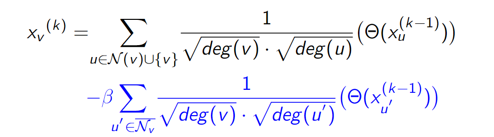
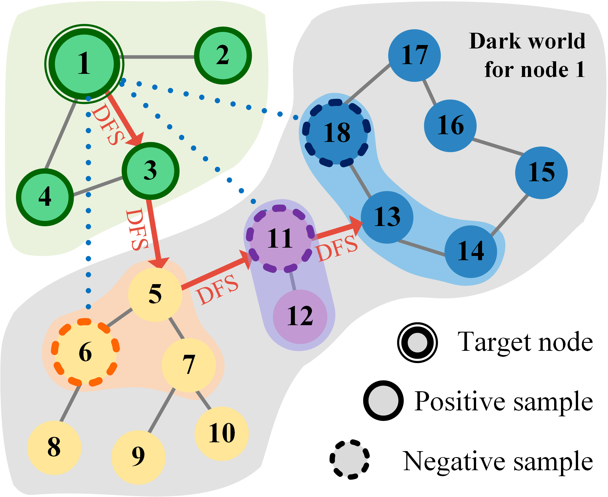
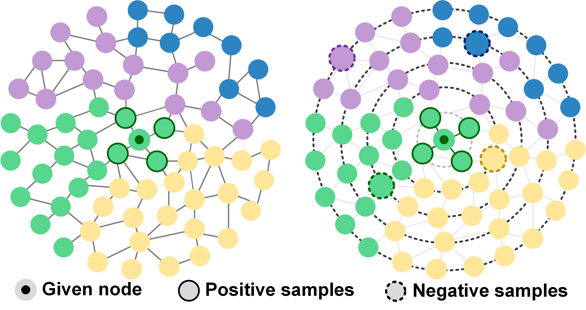
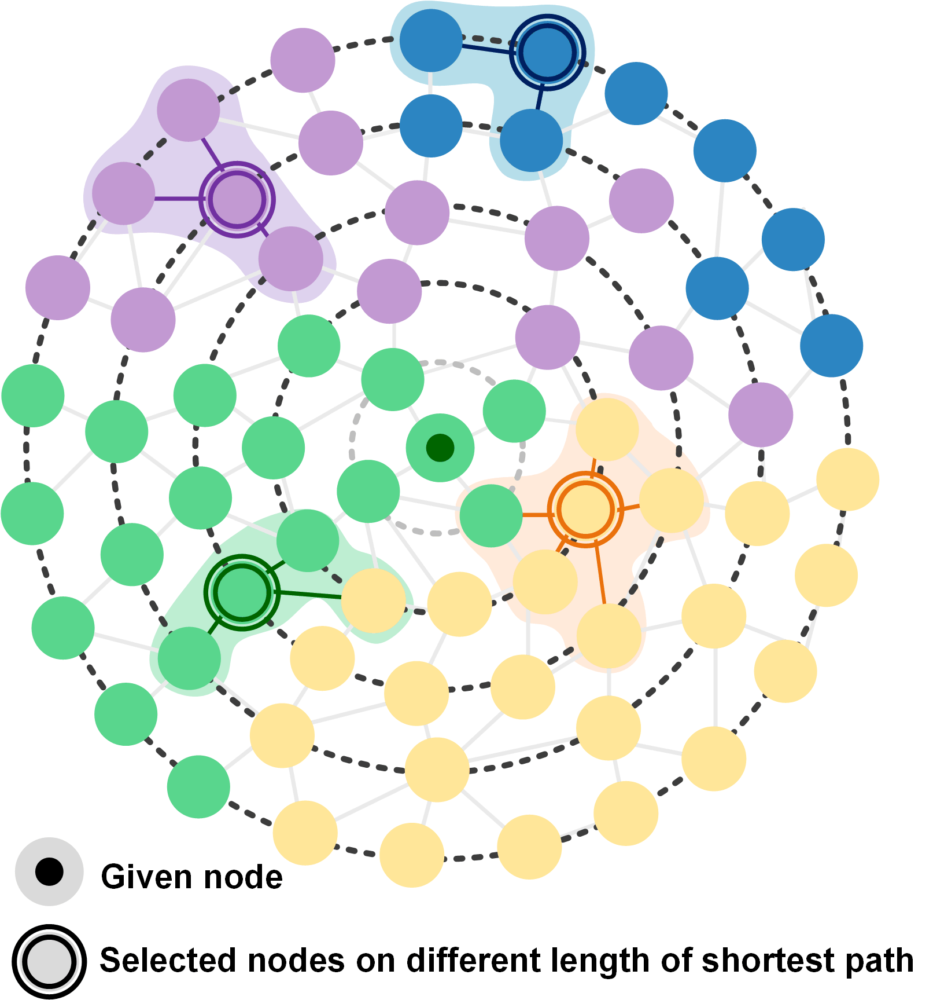

# Negative Samples-enhanced Graph Convolutional Neural Networks
Graph Convolutional Neural Networks (GCNs) have been generally accepted to be an effective tool for node representations learning. An interesting way to understand GCNs is to think of them as a message passing mechanism where each node updates its representation by accepting information from its neighbours (also known as positive samples). However, beyond these neighbouring nodes, graphs have a large, dark, all-but forgotten world in which we find the non-neighbouring nodes (negative samples).

We are the first to fuse negative samples into the graph convolution, yielding several new GCNs boosted by negative samples to improve the quality of node representations and alleviate the over-smoothing problem.

This repository is the official implementation of several methods to obtain negative samples and put them into convolutional operation, which can run directly on Google colab.

The vector form of a layer in Negative Samples-enhanced Graph Convolutional Neural Networks can be defined as this:

where $\overline{{\mathcal{N}}_i}$ is the negative samples of node $i$ and $\beta$ is a hyper-parameter to balance the contribution of the negative samples.

# 1. NegGCN (MCGCN) 
The first method is based on Monte Carlo chains. The negative samples were sampled using the method in [Understanding Negative Sampling in Graph Representation Learning](https://arxiv.org/pdf/2005.09863.pdf)

This work [Negative Samples-enhanced Graph Convolutional Neural Networks](https://ieeexplore.ieee.org/document/9755440) appeared in the 16-th International Conference on Intelligent Systems and Knowledge Engineering  (ISKE 2021)

.jpg)

Mechanism of the negative sampling graph convolution}. The central node is $v=5$ and $f(\cdot)$ is graph convolution layer\cite{kipf2016semi}. Node 4, 7 are directly linked with node 5 by real positive edges, thus positive sampling convolution is performed by $x_{pos}=f(4,7,5)$. Node 3, 8 are negative sampled using MCNS methods, which based on Markov chain MonteCarlo methods and DFS, message passing to central node $v=5$ along virtual imaginary edges, then negative sampling convolution is performed by $x_{neg}=f(3,8)$. Given a certain negative rate $\beta$, we get negative sampling graph convolution result of this layer, i.e. $x^{'} = x_{pos} -\beta x_{neg} $ 

# 2. D2GCN (DFS-DPP-GCN) 
The second method is based on determinant point process (DPP). DPP helps to get good negative samples, which contribute negative information to the give node contrast to its positive samples and include as much information as possible to reflect the variety of the dark world.

This work "Learning from the Dark: Boosting Graph Convolutional Neural Networks with Diverse Negative Samples" appeared in the 36-th AAAI Conference on Artificial Intelligence (AAAI 2022)

The concept of DPP-based negative sampling. The target node is Node 1. Nodes 2, 3 and 4 are positive samples. Nodes 5-18 are the dark world of Node 1. The 4-length DFS path of Node 1 is $\{3, 5, 11, 13\}$, where $\{5, 11, 13\}$ are the central nodes on the path in the dark world. With their first-order neighbouring nodes, they form the candidate set of DPPs, i.e.$\{5,6,7,11,12,13,14,18\}$. The selected negative samples from this set are 6, 11, and 18, which can be seen as virtual negative links to Node 1.

# 3. SDGCN (Shortest path-DPP-GCN)
The third method is based on decomposed determinant point process. We used quality-diversity decomposition in determinant point processes (DPP) to obtain diverse negative samples. When defining a distribution on diverse subsets of all non-neighbouring nodes, we incorporate both graph structure information and node representations. Since the DPP sampling process requires matrix eigenvalue decomposition, we propose a new shortest-path-base method to improve the computational efficiency.

This work has submitted to TNNLS and is under review.

Illustration of the motivation of this work. Left: For a given node, its first-order neighbours can be seen as positive samples.  Right: we compute the shortest path of the given node to other nodes. Different path lengths form concentric circles with different radii. Using DPP to select negative samples from different circles can get nodes for different clusters.

Taking the given point as the center of the circle, different path lengths form concentric circles with different radii. All reachable nodes $V_{r}$ can be divided into different sets $N_{l}$ based on the path length. We choose a random point in the node set $N_{l}$ of each length for starting $l = 2$, and the selected nodes and their first-order adjacent nodes become the candidates set $S_i$
